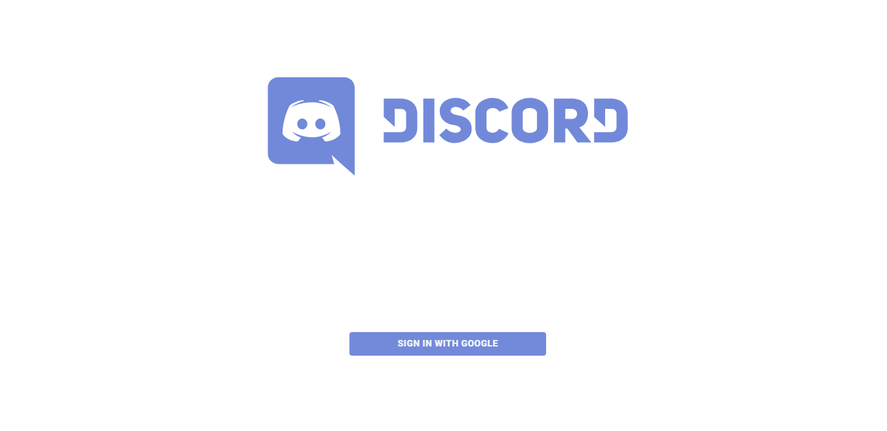
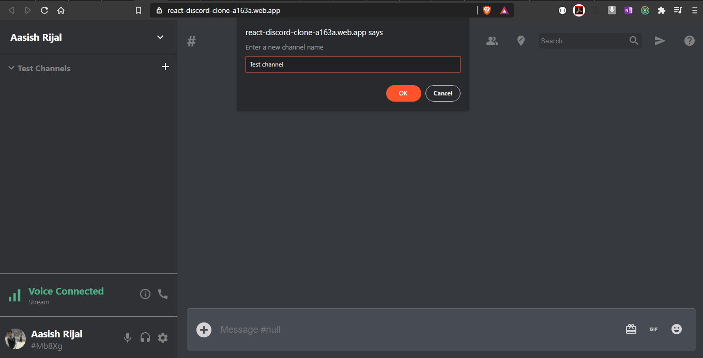
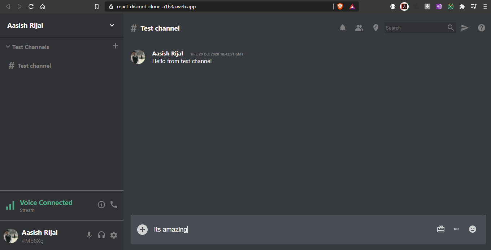
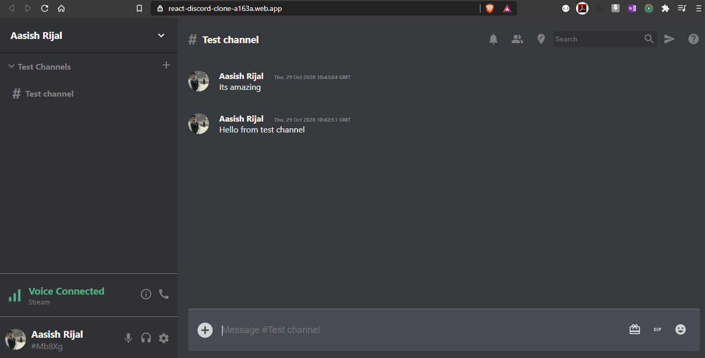

# Discord clone

  

  

**Description** :

  

Following UI is just clone of Discord web app. All the design credits and assets related to this project belongs to the owner self.

  

***Dependencies***

  

- @reduxjs/toolkit":  ^1.4.0

- @material-ui/core: ^4.11.0

- @material-ui/icons: ^4.9.1
- firebase: ^7.23.0
- react-redux:^7.2.1

  

  

## Demo Link : ` https://react-discord-clone-a163a.web.app/  ` or <a  href="https://react-discord-clone-a163a.web.app/">CLICK HERE</a>

  

**Tech Stacks***

| React Js | JavaScript | Jsx | Visual Code Studio | Firebase | Firebase Google Auth | Redux | 

# App Previews:

**Landing Page**

**Add Channel Screen**

**Message Typing Screen**

**Message Sent Screen**

